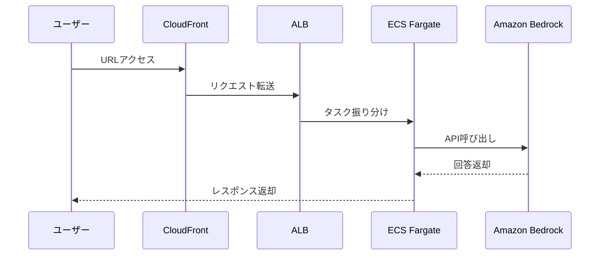

# AWS Hands-on 04: CloudFront + ALB + ECS + Bedrock

AWSのモダンなWebシステム構成（CDN + ロードバランサ + コンテナ）と、Amazon Bedrockによる生成AI連携を学ぶためのハンズオン教材です。

## 概要

このハンズオンでは、以下のAWSリソースを構築し、生成AI（Bedrock）と連携するWebアプリケーションをデプロイします。

- **CloudFront**: CDNとして静的コンテンツを配信
- **ALB (Application Load Balancer)**: ECSタスクへの負荷分散
- **ECS (Fargate)**: Node.js/Expressアプリの実行（Dockerコンテナ）
- **Amazon Bedrock**: 生成AI（モデル: Amazon Nova Microなど）の利用

## システム構成図

## 構成ファイル

- `cloudformation/handson/`: 段階的に構築するための分割テンプレート
- `cloudformation/完成形/`: 全リソースを一括で作成するテンプレート
- `docker/`: アプリケーションのソースコード
- `ecr/`: Dockerイメージビルド・プッシュ用スクリプト

## 使い方（デプロイ順）

1. **VPC基盤作成**: `01-network.yaml`
2. **セキュリティ設定**: `02-security.yaml`
3. **ロードバランサ作成**: `03-alb.yaml`
4. **ECSクラスター・アプリ起動**: `04-ecs-cluster.yaml`
5. **CDN公開**: `05-cloudfront.yaml`

---

## ハンズオン詳細ガイド

このガイドでは、インフラを段階的に組み立てながら、最終的な構成（CloudFront + ALB + ECS + Bedrock）を構築する手順を説明します。

### CloudFormation とは

AWS リソースを YAML で管理できる仕組み（Infrastructure as Code）です。
従来はマネジメントコンソールで 1 つずつ作成していましたが、CloudFormation を使うことで構成をテンプレート化し、再現性の高い構築が可能になります。

### 学習の進め方

1. **完成形をデプロイ**: `cloudformation/完成形/full-stack.yaml` を使用して全体像を把握します。
2. **段階的にデプロイ**: `cloudformation/handson/` 配下のテンプレートを 01 から 05 まで順番に実行し、各リソースの役割を理解します。

---

### Step 1: Network (VPC/Subnet)
VPC は、AWS 上に作る自分専用の仮想ネットワークです。

**確認ポイント:**
- **VPC**: `10.0.0.0/16` などの大きなネットワーク枠
- **Subnet**: 外部公開用のパブリックサブネット
- **IGW / Route Table**: インターネット通信のための経路設定

### Step 2: Security (Security Group)
Security Group は、リソース単位の仮想ファイアウォールです。

**確認ポイント:**
- **ALB 用**: HTTP(80) 通信を許可
- **ECS 用**: ALB からの通信のみを許可

### Step 3: ALB (Load Balancer)
ユーザーからのリクエストを受け付け、背後の複数のコンテナへ効率よく振り分けます。

**確認ポイント:**
- **Listener**: ポート 80 で待ち受けているか
- **Target Group**: ターゲットタイプが `ip` になっているか

### Step 4: ECS Cluster (Fargate)
Docker コンテナを実行・管理するサーバーレスな実行環境です。

**事前準備: Bedrock API キーの発行**
1. Bedrock コンソール > API Keys > Create API key
2. 発行されたキーを控えておき、ECS の環境変数に設定します。
   ※本ハンズオンでは簡略化のため API キーを使用しますが、実運用では IAM ロールが推奨されます。

**確認ポイント:**
- **Service/Task**: `RUNNING` 状態になっているか
- **Target Group**: ターゲットが `Healthy` になっているか
- **Logs**: CloudWatch Logs にアプリのログが出力されているか

### Step 5: CloudFront (CDN)
世界中に配置されたエッジロケーションから、高速かつ安全にコンテンツを配信します。

**確認ポイント:**
- **Origin**: ALB が正しく設定されているか
- **Behaviors**: HTTPS へのリダイレクトが設定されているか

### お片付け
余計な課金を防ぐため、使い終わったスタックを **05 -> 01 の逆順** で削除してください。
最後に Bedrock の API キーも削除してください。
