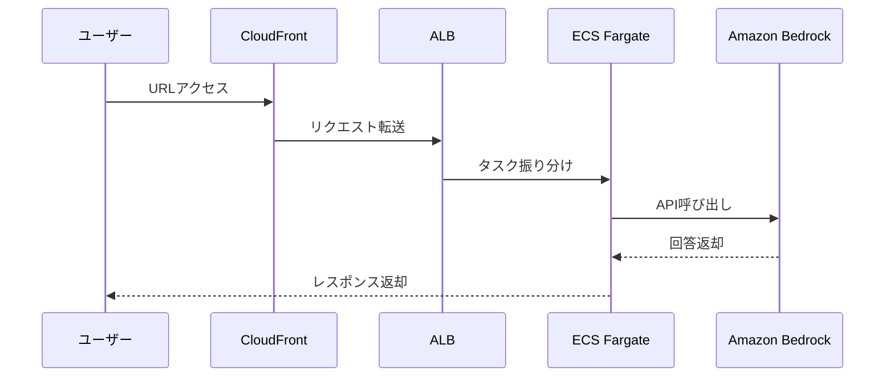

# AWS Hands-on 04: CloudFront + ALB + ECS + Bedrock

AWSのモダンなWebシステム構成（CDN + ロードバランサ + コンテナ）と、Amazon Bedrockによる生成AI連携を学ぶためのハンズオン教材です。

## 概要

このハンズオンでは、以下のAWSリソースを構築し、生成AI（Bedrock）と連携するWebアプリケーションをデプロイします。

- **CloudFront**: CDNとして静的コンテンツを配信
- **ALB (Application Load Balancer)**: ECSタスクへの負荷分散
- **ECS (Fargate)**: Node.js/Expressアプリの実行（Dockerコンテナ）
- **Amazon Bedrock**: 生成AI（モデル: Amazon Nova Microなど）の利用

## システム構成図

## 構成ファイル

- `cloudformation/handson/`: 段階的に構築するための分割テンプレート
- `cloudformation/完成形/`: 全リソースを一括で作成するテンプレート
- `docker/`: アプリケーションのソースコード
- `ecr/`: Dockerイメージビルド・プッシュ用スクリプト

## 使い方（デプロイ順）

1. **VPC基盤作成**: `01-network.yaml`
2. **セキュリティ設定**: `02-security.yaml`
3. **ロードバランサ作成**: `03-alb.yaml`
4. **ECSクラスター・アプリ起動**: `04-ecs-cluster.yaml`
5. **CDN公開**: `05-cloudfront.yaml`

# AWS Web システム ハンズオン説明資料

**CloudFront + ALB + ECS Fargate**

この資料は、よくある Web システムを題材に、
インフラを段階的に組み立てながら完成形へ到達するための説明用スライドです。

## このハンズオンで作るもの

- VPC と Public Subnet
- ALB と Security Group
- ECS Cluster、Task Definition、Service
- CloudWatch Logs
- CloudFront Distribution

### ゴール

ユーザーのアクセスが `CloudFront -> ALB -> ECS` を通り、
Web アプリケーションが安定して配信される状態を作ります。

# CloudFormation とは

AWS リソースを YAML で管理できる仕組みです。

従来は GUI で 1 つずつ作っていくことが多く、
リソースが増えると管理が大変になります。

CloudFormation を使うと、それらをテンプレートにまとめて書けます。

- VPC、Subnet、ALB、ECS などをテンプレートに書ける
- GUI でぽちぽち作らなくてもよくなる
- 同じ構成を何度も再現できる
- まとめて作成、更新、削除できる

このハンズオンでは、Web システムの構成を段階的に作っていきます。

## まず完成形を確認する

最初に `cloudformation/完成形/full-stack.yaml` を CloudFormation コンソールから
アップロードして、完成形がどうなるかを確認します。

- CloudFormation の「スタックを作成」画面を開く
- テンプレートをアップロードする
- `cloudformation/完成形/full-stack.yaml` を選ぶ
- 必要なパラメータを入れる
- スタックを作成して完成形を見る

これで、VPC から CloudFront まで一式がまとめて作成されます。

## 進め方

1. 完成形テンプレートを GUI からアップロードする
1. できあがる構成を確認する
1. それを 5 段階に分けて理解する

### ポイント

完成形を先に見ると、あとで分割した各スタックの役割がわかりやすくなります。

## デプロイ順

- `01-network.yaml` をアップロードしてネットワークを作る
- `02-security.yaml` をアップロードして Security Group を作る
- `03-alb.yaml` をアップロードして ALB を作る
- `04-ecs-cluster.yaml` をアップロードして ECS を作る
- `05-cloudfront.yaml` をアップロードして CloudFront を作る

## Step 1: Network / VPC とは

VPC は、AWS 上に作る自分専用の「仮想ネットワーク」です。

- **VPC**: `10.0.0.0/16` のような大きなネットワーク枠
- **Subnet**: その中を小さく分けたネットワーク
- **IGW / Route Table**: インターネットへ出るための経路

AWS 上で、家の中にルーターを 1 台置いて、自分専用のネットワークを作るイメージです。

## コンソールで見てみよう

実際に AWS コンソールで、Network の構成を見てみます。

- VPC
- Subnet
- Route Table
- Internet Gateway

見るポイント:

- VPC: `10.0.0.0/16` のような大きなネットワークが作られているか
- Subnet: VPC の中に小さく分けたネットワークが 2 つあるか
- Route Table: インターネットへ出るための経路が入っているか
- Internet Gateway: VPC にアタッチされているか

## Step 2: Security / Security Group とは

Security Group は、どこからの通信を受け付けるかを決める「仮想ファイアウォール」です。

- **ALB 用**: CloudFront からの HTTP 通信のみ許可
- **ECS 用**: ALB からのコンテナポート（3000）通信のみ許可

PC でいうところの「ファイアウォール」に近い役割です。

## コンソールで見てみよう

実際に AWS コンソールで、Security Group の設定を見てみます。

見るポイント:

- ALB 用の Security Group があるか
- ECS 用の Security Group があるか
- ALB は HTTP を許可しているか
- ECS は ALB からの通信だけ許可しているか

どこからの通信を許可しているかを確認します。

## Step 3: ALB / ロードバランサーとは

Web システムの入口となり、ユーザーからのリクエストを後ろのサーバーへ振り分けます。

### なぜ必要なのか？

- **負荷分散**: 複数のサーバーに分散
- **高可用性**: 故障しても正常な方へ転送
- **無停止更新**: 順次入れ替えが可能

### ないとどうなるのか？

- **拡張不可**: 1台の限界がシステムの限界
- **単一障害点**: 1台止まると全停止
- **更新停止**: アプリ更新時に遮断が必要

## コンソールで見てみよう

実際に AWS コンソールで、ALB の設定を見てみます。

見るポイント:

- ALB が作成されているか
- Listener が 80 番ポートで待ち受けているか
- Target Group が作成されているか
- Target Group の属性（Target type）が `ip` になっているか
  - ※この時点ではまだ ECS を作っていないので、ターゲット（宛先）は空で正常です

入口（ALB）と、その先の受け皿（Target Group）が用意されたことを確認します。

## 事前準備：Bedrock API キーの発行

ECS で動かすアプリが Bedrock を呼び出すための「鍵」を用意します。

1. **Bedrock コンソール**を開く
2. 左メニューの「**API Keys**」を選択
3. 「**Create API key**」をクリックして名前を入力
4. 発行された **API キー**をコピーして控えておく

**補足**: 本来は API キーではなく「IAM ロール（ECS タスクロール）」による認証が推奨されます。本ハンズオンでは手順を簡略化するため、API キーを使用しています。

## Step 4: ECS Cluster / ECS とは

Docker コンテナを AWS 上で効率よく管理・実行するためのサービスです。

**Fargate のメリット**:

- サーバー管理不要: 構築・運用が楽
- 自動復旧: 止まっても勝手に再起動
- スケーリング: 負荷に応じた拡張が容易

## ECS の起動タイプ（EC2 vs Fargate）

コンテナを「どこで」動かすかの選択肢です。

### EC2（サーバー管理あり）

- 自分で仮想サーバーを立てる
- OS の設定やアップデートが必要
- 空きリソースの管理が必要
- **「PC を自前で用意」するイメージ**

### Fargate（サーバーレス）

- **AWS がサーバーを管理**
- 自分は「IMAGE」を指定するだけ
- OS 管理やパッチ当ても不要
- **「必要な時だけ実行環境を借りる」イメージ**

このハンズオンでは、運用の手間が少ない **Fargate** を利用します。

## コンソールで見てみよう

実際に AWS コンソールで、ECS と ALB の連携を確認します。

見るポイント:

- **ECS Cluster / Service**: サービスが `ACTIVE` になっているか
- **Running Task**: タスクが 1 つ以上「実行中（RUNNING）」になっているか
- **Task Definition**: 環境変数（APIキー等）やイメージが正しく設定されているか
- **Log Group**: CloudWatch Logs にアプリのログが出力されているか
- **Target Group**: ターゲットに ECS タスクの IP が登録され、**`Healthy`** になっているか

ここで初めて、入口（ALB）から出口（ECS）までが一本の道として繋がります。

## やってみよう

ECS のタスクに直接アクセスできるか試してみましょう。

1. **タスクのパブリック IP を確認**: 実行中のタスク詳細から IP をコピー
2. **ブラウザでアクセス**: `http://[パブリックIP]:3000` を開く（※まだ繋がらないはず）
3. **SG を変更**: ECS 用の Security Group で、自分の IP（または `0.0.0.0/0`）からの `3000` ポートを許可する設定を追加
4. **再確認**: 直接アクセスできるようになったか確認

**注意**: 実運用ではセキュリティのため、直接アクセスは許可せず、ALB 経由のみに絞るのが一般的です。

## Step 5: CloudFront / CDN とは

最終的な公開入口です。ユーザーに最も近い場所から高速に配信します。

CloudFront は、世界中に配置されたサーバーからコンテンツを配信する「CDN」です。

- **エッジロケーション**: ユーザーに近い場所で応答
- **負荷軽減**: オリジン（ALB）へのリクエストを削減
- **セキュリティ**: DDoS 攻撃からの保護や HTTPS 化

## なぜ CDN を使うのか？

主な目的は「高速配信」「負荷軽減」そして「セキュリティ」です。

### 静的コンテンツの配信

- HTML, CSS, JS, 画像など
- ユーザーに物理的に近いサーバーから送るため、表示が速くなる

### 負荷軽減 (キャッシュ)

- データをエッジで一時保存
- オリジン（ALB/ECS）へのアクセスを減らし、サーバー負荷を抑える

### セキュリティの向上

- **DDoS対策**: 大規模な攻撃をエッジで受け流す
- **WAF連携**: 不正なアクセスを入口で遮断

## コンソールで見てみよう

実際に AWS コンソールで、CloudFront の設定を確認します。

見るポイント:

- **Distribution Status**: ステータスが `Enabled`（有効）かつ `Deployed` になっているか
- **Domain Name**: 割り当てられた `xxxx.cloudfront.net` の URL を確認
- **Origins**: オリジンとして ALB が正しく設定されているか
- **Behaviors**: `Viewer Protocol Policy` が `Redirect to HTTPS` になっているか

ブラウザで CloudFront の URL にアクセスし、アプリが表示されることを確認します。

## 動作確認

最後に、システムが正しく一本の道で繋がったか確認しましょう。

1. **CloudFront 経由でアクセス**: ブラウザで CloudFront の URL を開く
2. **Bedrock を実行**: 画面からプロンプトを入力し、AI の回答が返るか確認
3. **ECS ログの確認**: CloudWatch Logs で `[bedrock-request]` などのログが出ているか見る

**ゴール！**: CloudFront → ALB → ECS → Bedrock という全ての連携が成功です。

## お片付け

余計な課金を防ぐため、使い終わったリソースを削除しましょう。
作成したスタックを**「作成時とは逆の順番」**で削除します。

1. `handson-05-cloudfront` を削除
2. `handson-04-ecs-cluster` を削除
3. `handson-03-alb` を削除
4. `handson-02-security` を削除
5. `handson-01-network` を削除
6. **Bedrock API キー**を削除（コンソールから実施）

**注意**: スタックには依存関係があるため、必ず後ろの Step から順番に削除してください。

