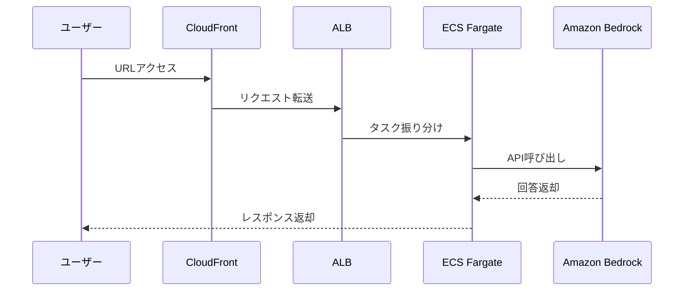

# AWS Hands-on 04: CloudFront + ALB + ECS + Bedrock

AWSのモダンなWebシステム構成（CDN + ロードバランサ + コンテナ）と、Amazon Bedrockによる生成AI連携を学ぶためのハンズオン教材です。

## 概要

このハンズオンでは、以下のAWSリソースを構築し、生成AI（Bedrock）と連携するWebアプリケーションをデプロイします。

- **CloudFront**: CDNとして静的コンテンツを配信
- **ALB (Application Load Balancer)**: ECSタスクへの負荷分散
- **ECS (Fargate)**: Node.js/Expressアプリの実行（Dockerコンテナ）
- **Amazon Bedrock**: 生成AI（モデル: Amazon Nova Microなど）の利用

## システム構成図

## 構成ファイル

- `cloudformation/handson/`: 段階的に構築するための分割テンプレート
- `cloudformation/完成形/`: 全リソースを一括で作成するテンプレート
- `docker/`: アプリケーションのソースコード
- `ecr/`: Dockerイメージビルド・プッシュ用スクリプト

## 使い方（デプロイ順）

1. **VPC基盤作成**: `01-network.yaml`
2. **セキュリティ設定**: `02-security.yaml`
3. **ロードバランサ作成**: `03-alb.yaml`
4. **ECSクラスター・アプリ起動**: `04-ecs-cluster.yaml`
5. **CDN公開**: `05-cloudfront.yaml`
