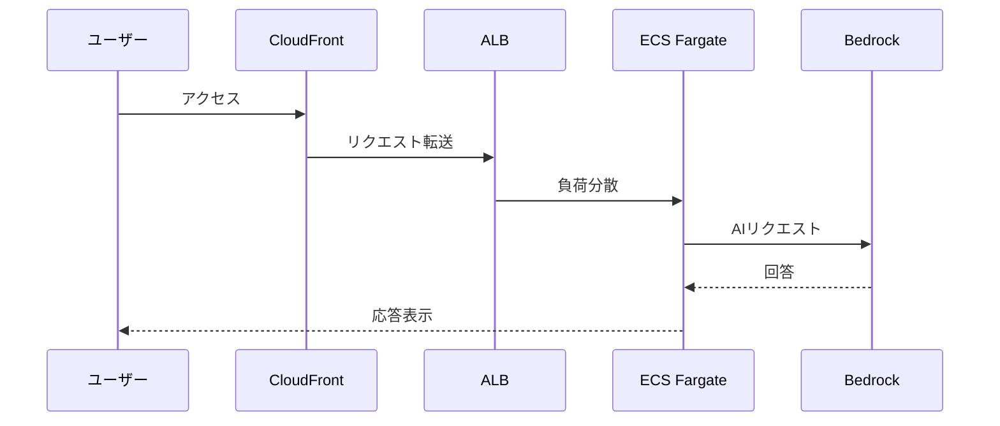

# 全体構成図 (Source)

```mermaid
sequenceDiagram
    participant U as ユーザー
    participant CF as CloudFront
    participant ALB as ALB
    participant ECS as ECS Fargate
    participant BD as Bedrock

    U->>CF: アクセス
    CF->>ALB: リクエスト転送
    ALB->>ECS: 負荷分散
    ECS->>BD: AIリクエスト
    BD-->>ECS: 回答
    ECS-->>U: 応答表示
```
